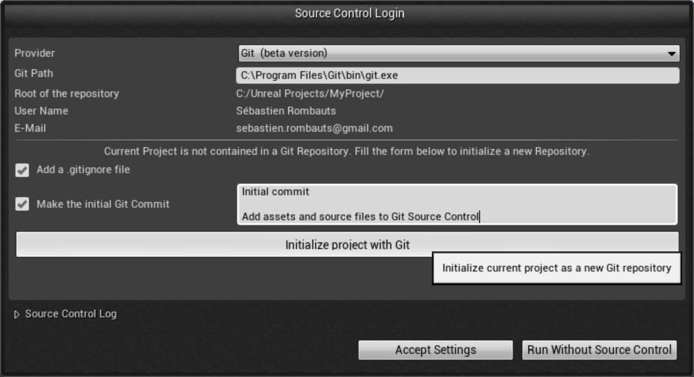
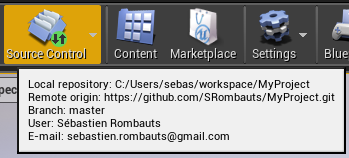
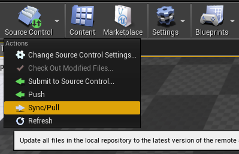
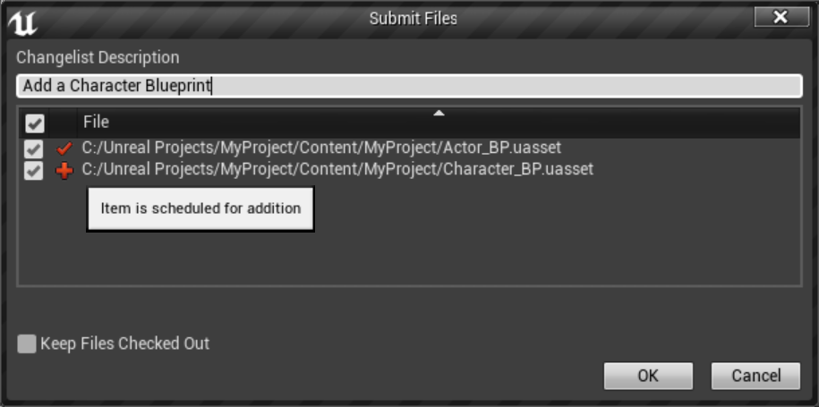
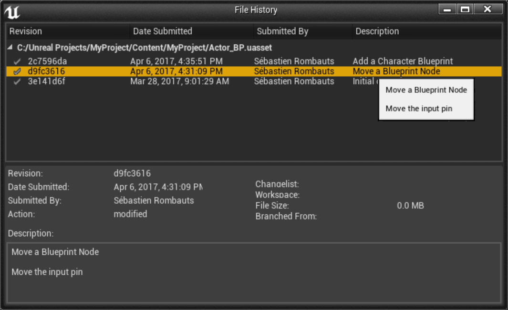
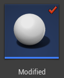

Unreal Engine 4 Git Source Control Plugin
-----------------------------------------

[](https://github.com/SRombauts/UE4GitPlugin/releases)
[](https://github.com/SRombauts/UE4GitPlugin/issues)
[](https://gitter.im/SRombauts/UE4GitPlugin)
UE4GitPlugin is a simple Git Source Control Plugin for **Unreal Engine 4.27**.

Developed and contributed by Sébastien Rombauts 2014-2022 (sebastien.rombauts@gmail.com)

- First version of the plugin has been **integrated by default in UE4.7 in "beta version"**.
- This is a developement fork named "**Git LFS 2**" adding File Locks supported by Github.

### Better Fork maintained by ProjectBorealis

ProjectBorealis has been busy fixing and improve this plugin to make it work robustly with LFS, and battle test.
**See [ProjectBorealis GitPlugin v3](https://github.com/ProjectBorealis/UEGitPlugin)**

### Instructions

You need to install it into your Project **Plugins/** folder, and it will overwrite (replace) the default "Git (beta version)" Source Control Provider with the "Git LFS 2" plugin.

Have a look at the [Git Plugin Tutorial on the Wiki](https://wiki.unrealengine.com/Git_source_control_%28Tutorial%29).  ([alternate link](https://michaeljcole.github.io/wiki.unrealengine.com/Git_source_control_%28Tutorial%29/))

Written and contributed by Sebastien Rombauts (sebastien.rombauts@gmail.com)

Source Control Login window to create a new workspace/a new repository:


Source Control status tooltip, when hovering the Source Control icon in toolbar:


Source Control top Menu, extended with a few commands specific to Git:


Submit Files to Source Control window, to commit assets:


File History window, to see the changelog of an asset:


Visual Diffing of two revisions of a Blueprint:


Merge conflict of a Blueprint:


Status Icons:





### Supported features
- initialize a new Git local repository ('git init') to manage your UE4 Game Project
  - can also create an appropriate .gitignore file as part of initialization
  - can also create a .gitattributes file to enable Git LFS (Large File System) as part of initialization
  - can also enable Git LFS 2.x File Locks as part of initialization
  - can also make the initial commit, with custom multi-line message
- display status icons to show modified/added/deleted/untracked files, not at head and conflicted
- show history of a file
- visual diff of a blueprint against depot or between previous versions of a file
- revert modifications of a file (works best with "Content Hot-Reload" experimental option of UE4.15, by default since 4.16)
- add, delete, rename a file
- checkin/commit a file (cannot handle atomically more than 50 files)
- migrate an asset between two projects if both are using Git
- solve a merge conflict on a blueprint
- show current branch name in status text
- Configure remote origin URL ('git remote add origin url')
- Sync to Pull (rebase) the current branch if there is no local modified files
- Push the current branch
- Git LFS (Github, Gitlab, Bitbucket), git-annex, git-fat and git-media are working with Git 2.10+
- Git LFS 2 File Locks
- Windows, Mac and Linux

### What *cannot* be done presently
- Branch/Merge are not in the current Editor workflow
- Amend a commit is not in the current Editor workflow
- Revert All (using either "Stash" or "reset --hard")
- Configure user name & email ('git config user.name' & git config user.email')
- Authentication is not managed if needed for Sync (Pull)

### Known issues
- #34 "outside repository" fatal error
- #37 Rebase workflow: conflicts not detected!
- #41 UE-44637: Deleting an asset is unsuccessful if the asset is marked for add (since UE4.13)
- #46 Merge Conflicts - Accept Target - causes engine to crash bug
- #47 Git LFS conflict resolution not working
- #49 Git LFS 2: False error in logs after a successful push
- #51 Git LFS 2: cannot revert a modified/unchecked-out asset
- #53 Git LFS 2: document the configuration and workflow
- #54 Poor performances of 'lfs locks' on Windows command line
- #55 Git LFS 2: Unlocking a renamed asset

- missing localisation for git specific messages
- displaying states of 'Engine' assets (also needs management of 'out of tree' files)
- renaming a Blueprint in Editor leaves a redirector file, AND modify too much the asset to enable git to track its history through renaming

### Getting started

Quick demo of the Git Plugin on Unreal Engine 4.12 (preview)
[](https://youtu.be/rRhPl9vL58Q)

#### Install Git

Under Windows 64bits, you should install the standard standalone Git for Windows
(now comming with Git LFS 2 with File Locking) with default parameters,
usually in "C:\Program Files\Git\bin\git.exe".

Then you have to configure your name and e-mail that will appear in each of your commits:

```
git config --global user.name "Sébastien Rombauts"
git config --global user.email sebastien.rombauts@gmail.com
```

#### Install this Git Plugin (dev) into your Game Project

Unreal Engine comes with a stable version of this plugin, so no need to install it.

This alternate "Git development plugin" needs to be installed into a subfolder or your Game Project "Plugins" directory
(that is, you cannot install it into the Engine Plugins directory):

```
<YourGameProject>/Plugins
```

You will obviously only be able to use the plugin within this project.

See also the [Plugins official Documentation](https://docs.unrealengine.com/latest/INT/Programming/Plugins/index.html)

#### Activate Git Source Control for your Game Project

Load your Game Project in Unreal Engine, then open:

```
File->Connect To Source Control... -> Git
```

##### Project already managed by Git

If your project is already under Git (it contains a ".git" subfolder), just click on "Accept Settings". This connect the Editor to your local Git repository ("Depot").

##### Project not already under Git

Otherwise, the Git Plugin is able to create (initialize) a new local Git Repository with your project Assets and Sources files:


Click "Initialize project with Git" that will add all relevant files to source control and make the initial commit with the customizable message.
When everything is done, click on "Accept Settings".

#### Using the Git Source Control Provider in the Unreal Engine Editor

The plugin mostly interacts with you local Git repository ("Depot"), not much with the remote server (usually "origin").

It displays Git status icons on top of assets in the Asset Browser:
- No icon means that the file is under source control and unchanged since last commit, or ignored.
- A red mark is for "modified" assets, that is the one that needs to be committed (so not the same as "Check-out" in Perforce/SVN/Plastic SCM).
- A red cross is for "added" assets, that also needs to be committed
- A blue lightning means "renamed".
- A yellow exclamation point is for files in conflict after a merge, or is not at head (latest revision on the current remote branch).
- A yellow question mark is for files not in source control.

TODO:
- specifics of rename and redirectors, and "Fix Up Redirector in Folder" command
- history / visual diff
- CheckIn = Commit
- CheckOut = Commit+Push+unlock (when using LFS 2)

See also the [Source Control official Documentation](https://docs.unrealengine.com/latest/INT/Engine/UI/SourceControl/index.html)

### License

Copyright (c) 2014-2020 Sébastien Rombauts (sebastien.rombauts@gmail.com)

Distributed under the MIT License (MIT) (See accompanying file LICENSE.txt
or copy at http://opensource.org/licenses/MIT)

## How to contribute
### GitHub website
The most efficient way to help and contribute to this wrapper project is to
use the tools provided by GitHub:
- please fill bug reports and feature requests here: https://github.com/SRombauts/UE4GitPlugin/issues
- fork the repository, make some small changes and submit them with independent pull-requests

### Contact
- You can use the Unreal Engine forums.
- You can also email me directly, I will answer any questions and requests.

### Coding Style Guidelines
The source code follow the Unreal Engine official [Coding Standard](https://docs.unrealengine.com/latest/INT/Programming/Development/CodingStandard/index.html):
- CamelCase naming convention, with a prefix letter to differentiate classes ('F'), interfaces ('I'), templates ('T')
- files (.cpp/.h) are named like the class they contains
- Doxygen comments, documentation is located with declaration, on headers
- Use portable common features of C++11 like nullptr, auto, range based for, override keyword
- Braces on their own line
- Tabs to indent code, with a width of 4 characters

## See also

- [Git Source Control Tutorial on the Wikis](https://wiki.unrealengine.com/Git_source_control_(Tutorial))
- [UE4 Git Plugin website](http://srombauts.github.com/UE4GitPlugin)

- [ue4-hg-plugin for Mercurial (and bigfiles)](https://github.com/enlight/ue4-hg-plugin)
